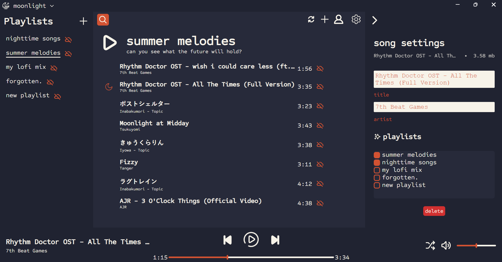

<link rel="shortcut icon" type="image/x-icon" href="moonlight.png">

# moonlight 

 

A simple music player for those late nights.

## installation

download and extract one of these:
 - [windows](https://www.dropbox.com/scl/fi/meg7vjraike6t9nb9snhh/moonlight-win32-x64.zip?rlkey=34uwzi0fhxpd85d6sfedyfpfk&st=p0qnbyzh&dl=1)
 - [mac](https://www.dropbox.com/scl/fi/bczwhcffqszngkyyyytwr/moonlight-darwin-x64.zip?rlkey=njqe7l8djcqqpp1ztnhxce4v8&st=vnb6lddt&dl=1)
 - [linux](https://www.dropbox.com/scl/fi/salbffps2nx4ixffrst15/moonlight-linux-x64.zip?rlkey=ixnz81q39nlc480xtci85z6y0&st=jz237mwp&dl=1)

open the extracted folder and run `moonlight.exe`/`moonlight.app`/`moonlight`

to **uninstall**, simply delete the extracted folder

## why use moonlight?

 - offline*
 - listen to anything
 - directly search for and download songs and playlists from youtube 
 - sync your songs across devices

**of course, internet is required when syncing with cloud*

## you should know
When syncing your data, all of your files (`.mp3`, `.wav`, etc.) are sent to my server. *(my spare laptop)*

**I cannot snoop into the files you upload, even if I wanted to,** as they are encrypted prior to uploading. [more details](readme-resources/privacy.md)

So feel free to listen to [anything you want](https://www.youtube.com/watch?v=lrbOiYrMSPk) - I can't judge! 

### [view server repository here](https://github.com/troylu8/moonlight-server) 