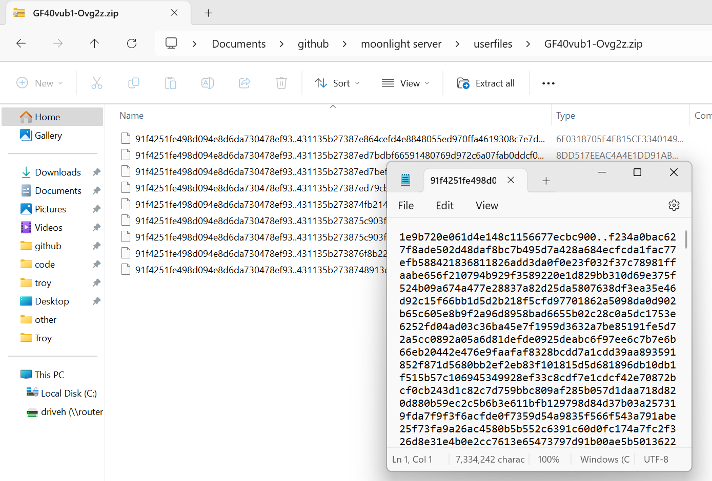

## moonlight - privacy
Upon creating an account or signing in, your password is *hashed* before being sent to the server. 
As far as the server (and therefore I,) know, this **hash** is your password, *while your **actual password** never touches the server.*

When you hit the sync button, your files are encrypted with your **actual password** as the key before being sent. 

So if I peek into your files, without your **actual password**, all I'll ever see is encrypted gibberish.

What I see:

This is also why it takes forever to change your password - everything has to be re-encrypted and re-uploaded.

Your actual password is saved between sessions by encrypting it using Electron's [`safeStorage`](https://www.electronjs.org/docs/latest/api/safe-storage), which leaves encryption up to your OS. I consider that [safe enough](https://stackoverflow.com/questions/72951071/is-electrons-safestorage-for-passwords-and-login-credentials). 